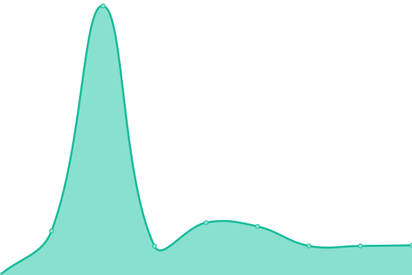

# [📈 Live Status](https://Revival-Dev.github.io/severus): <!--live status--> **🟩 All systems operational**

This repository contains the open-source uptime monitor and status page for [RevivaLTV](https://revivaltv.id), powered by [Upptime](https://github.com/upptime/upptime).

With [Upptime](https://upptime.js.org), you can get your own unlimited and free uptime monitor and status page, powered entirely by a GitHub repository. We use [Issues](https://github.com/Revival-Dev/severus/issues) as incident reports, [Actions](https://github.com/Revival-Dev/severus/actions) as uptime monitors, and [Pages](https://Revival-Dev.github.io/severus) for the status page.

<!--start: status pages-->
<!-- This summary is generated by Upptime (https://github.com/upptime/upptime) -->
<!-- Do not edit this manually, your changes will be overwritten -->
<!-- prettier-ignore -->
| URL | Status | History | Response Time | Uptime |
| --- | ------ | ------- | ------------- | ------ |
|  [Portal](https://www.revivaltv.id) | 🟩 Up | [portal.yml](https://github.com/Revival-Dev/severus/commits/HEAD/history/portal.yml) | 

 2529ms
     
 | 

<a href="https://status.revivaltv.id/history/portal">100.00%</a>
    

|  [RevivalPedia](https://revivalpedia.com) | 🟩 Up | [revival-pedia.yml](https://github.com/Revival-Dev/severus/commits/HEAD/history/revival-pedia.yml) | 

 1413ms
     
 | 

<a href="https://status.revivaltv.id/history/revival-pedia">100.00%</a>
    

|  [RevivalPedia API](https://api.revivalpedia.com) | 🟩 Up | [revival-pedia-api.yml](https://github.com/Revival-Dev/severus/commits/HEAD/history/revival-pedia-api.yml) | 

 669ms
     
 | 

<a href="https://status.revivaltv.id/history/revival-pedia-api">100.00%</a>
    

|  [Livescore](https://livescore.revivaltv.id/api/tournaments) | 🟩 Up | [livescore.yml](https://github.com/Revival-Dev/severus/commits/HEAD/history/livescore.yml) | 

 763ms
     
 | 

<a href="https://status.revivaltv.id/history/livescore">100.00%</a>
    

|  [Beta RevivalTV](https://beta.revivaltv.id) | 🟩 Up | [beta-revival-tv.yml](https://github.com/Revival-Dev/severus/commits/HEAD/history/beta-revival-tv.yml) | 

 1180ms
     
 | 

<a href="https://status.revivaltv.id/history/beta-revival-tv">100.00%</a>
    

<!--end: status pages-->

[**Visit our status website →**](https://Revival-Dev.github.io/severus)

## 📄 License

- Powered by: [Upptime](https://github.com/upptime/upptime)
- Code: [MIT](./LICENSE) © [RevivaLTV](https://revivaltv.id)
- Data in the `./history` directory: [Open Database License](https://opendatacommons.org/licenses/odbl/1-0/)
